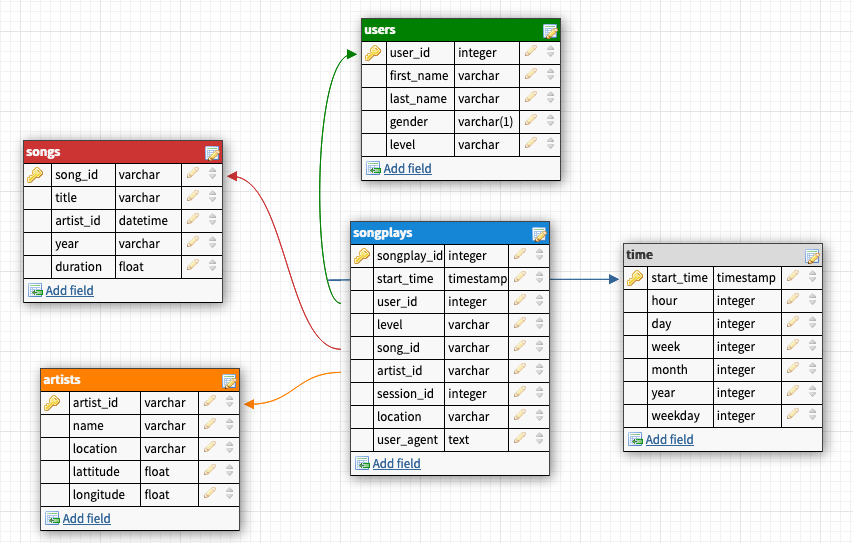

# Project 1: Data Modeling with Postgres

## Summary

* [Approach] (#Approach)
* [Purpose] (#Purpose)
* [Schema definition] (#Schema-definition)
* [How to run] (#How-to-run)
* [Example queries] (#Example-queries)
--------------------------------------------

### Approach
To complete this project the following steps were followed:

* Create neccesarry tables
* Build ETL Processes and ETL Pipeline
* Document the process

### Purpose
Sparkify is a music streaming startup which provides free and premium plans. Sparkify is using .json files to store their song and user data. This project implements more efficient and sophisticated data warehouse that will be used in future analysis of the data to gain insights and implement necessary bussiness decisions in order to convert free plans to premium plans as much as possible.

### Schema definition
The database is created in PostgreSQL using Star Schema.

There are four dimension tables:
* users - provides information on users
* songs - provides information on songs
* artists - provides information on artists
* time - timestamps of records in songplays converted to other time units
 The fact table is:
* songplays - records log data



### How to run

```
python create_tables.py   # create database and empty tables
python etl.py             # populate tables with provided data
```

Note: The necessary data should be provided in the source folder with the following structure:
* /data/song_data - folder that contains metadata about a song, each file should be in JSON format and contain metadata about a song and the artist of that song, the files should be partitioned by the first three letters of each song's track ID.
* /data/log_data - folder that contains files of log files in JSON format, the log files in the dataset you'll be working with are partitioned by year and month.

### Example queries

In order to see how many free or premium plans are being used, one would run following query:

``` SQL
SELECT level, count(level) DESC FROM songplays GROUP BY level ORDER BY count DESC;
```

In order to see what users are using Sparkify one would run the following query:

``` SQL
SELECT 
    users.first_name as first_name,
    users.last_name as last_name,
    songplays.level,
    count(start_time) as count
FROM songplays, users
WHERE users.user_id=songplays.user_id
GROUP BY first_name, last_name, songplays.level
ORDER BY count DESC;
```

