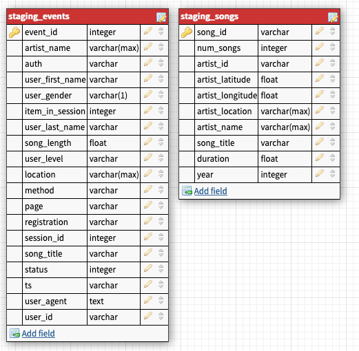
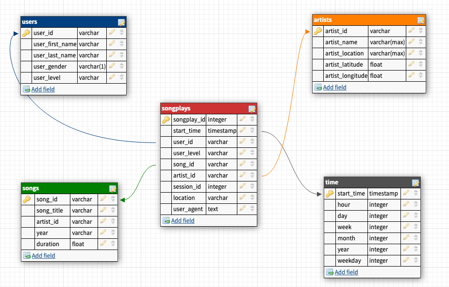

# Project 3: Data Warehouse with Redshift

## Summary

* [Approach](#Approach)
* [Purpose] #Purpose)
* [Schema definition](#Schema-definition)
* [How to run](#How-to-run)
* [Example queries](#Example-queries)
--------------------------------------------

### Approach
To complete this project the following steps were followed:

* Create neccesarry tables
* Build ETL Processes and ETL Pipeline for a database hosted on Redshift
    * create a Redshift clusterž
    * load data from S3 to staging tables on Redshift
    * transforms data into a set of dimensional tables
* Document the process

### Purpose
A music streaming startup, Sparkify, has grown their user base and song database and want to move their processes and data onto the cloud. Their data resides in S3, in a directory of JSON logs on user activity on the app, as well as a directory with JSON metadata on the songs in their app. We are building an ETL pipeline that extracts their data from S3, stages them in Redshift, and transforms data into a set of dimensional tables for their analytics team to continue finding insights in what songs their users are listening to.

### Schema definition
We are using two staging tables to load our data to the Redshift. The first staging table is `staging_events` table that is used to load the log data from the S3 bucket `s3://udacity-dend/log_data`, and the other staging table is `staging_songs` table that is used to load the song data from the S3 bucket `s3://udacity-dend/song_data`. 



The database is created in PostgreSQL using Star Schema.

There are four dimension tables:
* users - provides information on users
* songs - provides information on songs
* artists - provides information on artists
* time - timestamps of records in songplays converted to other time units
 The fact table is:
* songplays - records log data



### How to run

```
create_redshift_cluster.ipynb # run the Jupyter notebook to create a Redshift Cluster
python create_tables.py   # create database and empty tables
python etl.py             # populate tables with provided data
```

Note: The necessary data should be populated in the two config files:
* `create_cluster.cfg` - config to the Redsift cluster creation
    * [AWS]
        * KEY=<aws_key>
        * SECRET=<aws_secret>
    * [DWH] 
        * DWH_CLUSTER_TYPE=<cluster_type>
        * DWH_NUM_NODES=<number_of_nodes>
        * DWH_NODE_TYPE=<node_type>
        * DWH_IAM_ROLE_NAME=<iam_role_name>
        * DWH_CLUSTER_IDENTIFIER=<cluster_identifier>
        * DWH_DB=<database_name>
        * DWH_DB_USER=<database_user>
        * DWH_DB_PASSWORD=<database_password>
        * DWH_PORT=<database_port>

* `create_cluster.cfg` - config to the Redsift cluster creation
    * [CLUSTER]
        * HOST=<redshift_cluster_host>
        * DB_NAME=<database_name>
        * DB_USER=<database_user>
        * DB_PASSWORD=<database_password>
        * DB_PORT=<database_port>
    * [IAM_ROLE]
        * ARN=<iam_role>
    * [S3]
        * LOG_DATA=<s3_log_data_bucket>
        * LOG_JSONPATH=<s3_log_json_path>
        * SONG_DATA=<s3_song_data_bucket>


### Example queries

In order to see how many free or premium plans are being used, one would run following query:

``` SQL
SELECT user_level, count(user_level) as count FROM songplays GROUP BY user_level ORDER BY count DESC;
```

In order to see what users are using Sparkify one would run the following query:

``` SQL
SELECT 
    users.user_first_name as first_name,
    users.user_last_name as last_name,
    songplays.user_level,
    count(start_time) as count
FROM songplays, users
WHERE users.user_id=songplays.user_id
GROUP BY first_name, last_name, songplays.user_level
ORDER BY count DESC;
```

