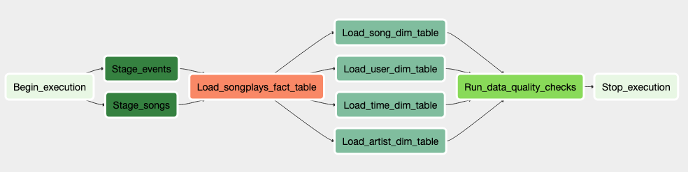

# Project 5: Data Warehouse with Redshift

## Summary

* [Approach](#Approach)
* [Purpose](#Purpose)
* [Schema definition](#Schema-definition)
* [Data pipeline](#Data-pipeline)
* [How to run](#How-to-run)
--------------------------------------------

### Approach
To complete this project the following steps were followed:

* Create neccesarry tables
* Build ETL Processes and ETL Pipeline for a database hosted on Redshift
    * create a Redshift cluster
    * load data from S3 to staging tables on Redshift
    * transforms data into a set of dimensional tables
* Create the Airflow DAG
* Document the process

### Purpose
A music streaming company, Sparkify, has decided that it is time to introduce more automation and monitoring to their data warehouse ETL pipelines and come to the conclusion that the best tool to achieve this is Apache Airflow. We had created data pipelines that are dynamic and built from reusable tasks, can be monitored, and allow easy backfills. The data quality plays a big part when analyses are executed on top the data warehouse and want to run tests against their datasets after the ETL steps have been executed to catch any discrepancies in the datasets.

### Schema definition
We are using two staging tables to load our data to the Redshift. The first staging table is `staging_events` table that is used to load the log data from the S3 bucket `s3://udacity-dend/log_data`, and the other staging table is `staging_songs` table that is used to load the song data from the S3 bucket `s3://udacity-dend/song_data`. 

The database is created in PostgreSQL using Star Schema.

There are four dimension tables:
* users - provides information on users
* songs - provides information on songs
* artists - provides information on artists
* time - timestamps of records in songplays converted to other time units
 The fact table is:
* songplays - records log data

### Data pipeline
We have created a data pipeline that consists of following operators: Stage to Redshift Operator, Load Dimension Operator, Load Fact Operator and Data Quality Operator.
The Stage to Redshift Operator will copy the provided files into the Redshift cluster to the specified staging tables. To load data from the provided staging tables into dimension tables we are using the Load Dimension Operator, while the Load Fact Operator is used to load data from the staging tables into fact tables. Finally, the Data Quality Operator checks if the tables are correctly populated, and other operators jobs finished succesfully. The graphical representation of our data pipeline is shown in the image below:  

### How to run

Start Apache Airflow using `start.sh` script. Before starting a DAG, you need to use Airflow's UI to configure your AWS credentials and connection to Redshift. Run the `udac_example_dag` DAG.
